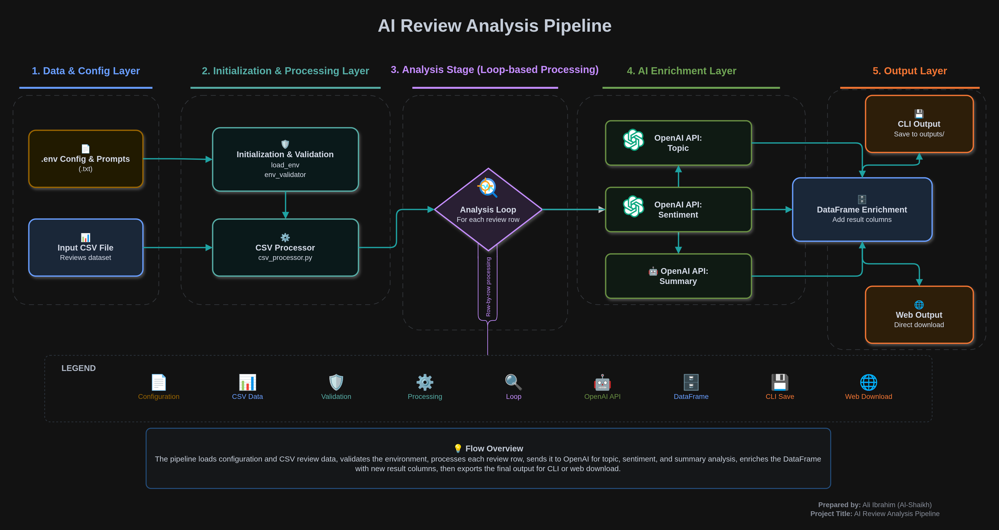

# AI-Powered Customer Review Analyzer

> Automatically extract **topics**, classify **sentiment**, and generate **summaries** from customer reviews using OpenAI's LLMs — with both a CLI pipeline and an interactive Streamlit web interface.


---

## Table of Contents

- [Overview](#overview)
- [Live Demo](#live-demo)
- [Architecture Diagram](#architecture-diagram)
- [Workflow](#workflow)
- [Project Structure](#project-structure)
- [Features](#features)
- [Tech Stack](#tech-stack)
- [Getting Started](#getting-started)
  - [Prerequisites](#prerequisites)
  - [Installation](#installation)
  - [Environment Setup](#environment-setup)
- [Usage](#usage)
  - [CLI Mode](#cli-mode)
  - [Streamlit Web App](#streamlit-web-app)
- [Prompt Engineering](#prompt-engineering)
- [Input Format](#input-format)
- [Output Format](#output-format)
- [Limitations & Known Issues](#limitations--known-issues)
- [Notes](#notes)
- [Contributing](#contributing)
- [License](#license)
- [Author](#author)

---

## Overview

This project is an end-to-end NLP pipeline that leverages Large Language Models (LLMs) via the OpenAI API to perform three independent analyses on customer reviews:

| Analysis | Description | Output |
|---|---|---|
| **Topic Extraction** | Identifies the main subject or theme of each review | Short phrase (e.g. `Product Quality`) |
| **Sentiment Classification** | Labels the emotional tone of each review | `POSITIVE` / `NEGATIVE` / `NEUTRAL` |
| **Review Summarization** | Condenses each review into a single sentence | One concise sentence |

Each analysis runs as a **separate, focused API call** — a deliberate design choice that produces cleaner results than bundling all tasks into one prompt, at the cost of higher token usage per review.

The project supports two modes of operation:
- **CLI** — batch processing from the terminal, output saved to `outputs/`
- **Streamlit Web App** — interactive UI with row-range selection, live progress, and CSV download

---

## Live Demo

🔗 **[Try it on Streamlit Cloud](https://ai-powered-customer-review-analyzer-eg5p7l2qb3txdsxd3huhjr.streamlit.app/)**

> To use the demo, bring your own OpenAI API key — enter it in the sidebar. No data is stored or logged.

---

## Architecture Diagram

The following diagram illustrates how data flows through the system — from raw input, through the LLM pipeline, to enriched output.



> **Why separate API calls per task?** Bundling topic + sentiment + summary into one prompt causes the model to trade off between tasks and produce lower-quality results for each. Separate calls with focused system prompts yield more consistent, structured outputs — at the cost of up to 3× the token usage per review.                          

---

## Workflow

The following describes the exact execution flow from start to finish, tracing every step through the codebase.

### Step 1 — Environment Initialization
```
.env  ──►  load_env.py  ──►  main.py  ──►  env_validator.py
```
- At import time, `load_env.py` calls `load_dotenv()` and reads `OPENAI_API_KEY` and `MODEL_NAME` from the `.env` file into two module-level variables (`api_key`, `model_name`).
- `main.py` imports these variables from `load_env` and immediately passes them to `validate_env()` from `env_validator.py`.
- `env_validator.py` raises a `ValueError` if either value is missing or empty — stopping execution before any file or API access begins.

### Step 2 — Prompt Loading
```
prompts/*.txt  ──►  prompt_loader.py  ──►  prompt_variables.py  ──►  ai_enrichment.py
```
- `ai_enrichment.py` imports four prompt variables directly from `prompt_variables.py` at the top of the file, triggering their resolution immediately at import time.
- `prompt_variables.py` calls `prompt_load()` from `prompt_loader.py` for each of the 4 prompt files (`topic_extraction.txt`, `sentiment_analysis.txt`, `summarize_reviews.txt`, `review.txt`).
- `prompt_loader.py` opens each `.txt` file, validates it is not empty, and returns the content as a string.
- All 4 prompts are stored as module-level variables in `prompt_variables.py` — loaded once from disk, reused for every review row.
- The **system/user split** is intentional: system prompts define the model's role and output constraints; the user prompt template injects the dynamic review text per row.

### Step 3 — CSV Validation & Loading
```
main.py  ──►  error_handler.check_csv_file()
main.py  ──►  csv_processor.read_csv()
```
- `main.py` calls `check_csv_file(data_file_path)` from `error_handler.py` directly — this verifies the file exists on disk and is not zero bytes, raising `FileNotFoundError` or `EmptyDataError` before pandas is involved.
- `main.py` then calls `csv_processor.read_csv()` which loads the file with `pd.read_csv()` and raises a `ValueError` if the DataFrame has no rows.

### Step 4 — LLM Analysis Loop
```
main.py  ──►  csv_processor.analyze_review()  ──►  ai_enrichment.enrich_review()  ──►  llm_client.ask_llm()  ──►  OpenAI API
```
- `main.py` calls `csv_processor.analyze_review(df)`, which iterates over every row in the `review` column and calls `ai_enrichment.enrich_review(review)` for each one.
- `enrich_review()` first builds the user prompt via `build_prompt(review)` — a lambda wrapping `user_template.format(review=review)` — then calls three focused functions: `add_topics()`, `add_summaries()`, and `add_sentiments()`.
- Each of these three functions calls `llm_client.ask_llm()` with its own dedicated system prompt, keeping each task isolated and independently controllable.
- `ask_llm()` constructs the `[system, user]` messages array and calls `client.chat.completions.create()`.
- `enrich_review()` returns a dict `{"topic": ..., "summary": ..., "sentiment": ...}` per review, collected into a `results[]` list in `analyze_review()`.
- Any API error is caught by `handle_openai_err()` in `error_handler.py`, returning a human-readable string instead of crashing.

### Step 5 — DataFrame Enrichment
```
csv_processor.analyze_review()  ──►  df (new columns assigned from results list)
```
- After the loop completes, `analyze_review()` unpacks `results[]` into three new DataFrame columns:
  - `df['topic']     = [r.get('topic')     for r in results]`
  - `df['summary']   = [r.get('summary')   for r in results]`
  - `df['sentiment'] = [r.get('sentiment') for r in results]`
- The enriched DataFrame is returned to `main.py`.

### Step 6 — Output
```
main.py  ──►  csv_processor.get_output_filename()  ──►  csv_processor.save_csv()
```
- **CLI:** `main.py` calls `get_output_filename()` which prompts the user for a filename and checks it does not already exist in `outputs/`, then calls `save_csv()` which writes the enriched DataFrame with `df.to_csv()`.
- **Streamlit:** The download button triggers `df_to_csv_bytes()` and streams the file directly to the browser — no disk write required.

---

## Project Structure

```
ai_powered_customer_review_analyzer/
│
├── data/
│   └── customer_review.csv        # Input CSV file with customer reviews
│
├── outputs/                       # Generated output CSV files (CLI mode)
│
├── prompts/
│   ├── system/
│   │   ├── sentiment_analysis.txt # System prompt: classify as POSITIVE/NEGATIVE/NEUTRAL
│   │   ├── summarize_reviews.txt  # System prompt: summarize in one sentence
│   │   └── topic_extraction.txt   # System prompt: extract one topic phrase
│   └── user/
│       └── review.txt             # User prompt template: injects {review} variable
│
├── src/
│   ├── csv_processor.py           # CSV reading, analysis orchestration, and saving
│   ├── env_validator.py           # Validates required environment variables
│   ├── error_handler.py           # Centralized error handling for OpenAI and file errors
│   ├── llm_client.py              # OpenAI API client and completion logic
│   ├── load_env.py                # Loads API key and model name from .env
│   ├── main.py                    # CLI entry point
│   ├── prompt_loader.py           # Loads prompt files from disk
│   └── prompt_variables.py        # Resolves and exposes all prompt variables
│
├── app.py                         # Streamlit web interface
├── .env                           # Your local secrets (git-ignored)
├── .env.example                   # Environment variable template
├── .gitignore
├── LICENSE
└── requirements.txt
```

---

## Features

- **Modular architecture** — each concern (LLM calls, CSV processing, error handling, prompt loading) is cleanly separated into its own module with a single responsibility
- **Prompt-file-driven** — all system and user prompts are stored as `.txt` files, enabling iteration on prompt quality without touching Python code
- **Focused single-task prompts** — each analysis (topic / sentiment / summary) uses a dedicated system prompt and API call for higher output quality
- **Flexible analysis** — any combination of the three analyses can be enabled or disabled independently
- **Row-range selection** — analyze any slice of the dataset (e.g. rows 50–100) without loading it all into the LLM
- **Two interfaces** — terminal CLI for scripting and automation, Streamlit web app for interactive use
- **Robust error handling** — covers missing files, empty CSVs, invalid API keys, and connection errors gracefully
- **Environment-based config** — API key and model name loaded from `.env`, never hardcoded
- **Zero disk writes on web** — Streamlit mode streams results directly to the browser as a CSV download

---

## Tech Stack

| Layer | Technology | Version |
|---|---|---|
| Language | Python | 3.10+ |
| LLM Provider | OpenAI API | `openai==2.43.0` |
| Data Processing | pandas | `3.0.3` |
| Web Interface | Streamlit | `1.58.0` |
| Config Management | python-dotenv | `1.2.2` |

---

## Getting Started

### Prerequisites

- Python 3.10 or higher
- An active [OpenAI API key](https://platform.openai.com/api-keys)
- `pip` and `venv` (included with Python)

### Installation

```bash
# 1. Clone the repository
git clone https://github.com/ali-ibrahim-alshaikh/ai-powered-customer-review-analyzer.git
cd ai-powered-customer-review-analyzer

# 2. Create and activate a virtual environment
python -m venv .venv
source .venv/bin/activate        # On Windows: .venv\Scripts\activate

# 3. Install dependencies
pip install -r requirements.txt
```

### Environment Setup

```bash
cp .env.example .env
```

Open `.env` and set your values:

```env
OPENAI_API_KEY = sk-proj-...
MODEL_NAME = gpt-4o-mini
```

> The `.env` file is listed in `.gitignore` and will **never** be committed to version control.

---

## Usage

### CLI Mode

Run from the **project root** (not from inside `src/`):

```bash
python -m src.main
```

**What happens step by step:**
1. Validates that `OPENAI_API_KEY` and `MODEL_NAME` are set
2. Checks that `data/customer_review.csv` exists and is not empty
3. Reads the configured rows from the CSV
4. Sends each review to the OpenAI API for the selected analyses
5. Prompts you to enter a name for the output file
6. Saves the enriched CSV to `outputs/`

### Streamlit Web App

**Run locally:**
```bash
streamlit run app.py
```

**Or use the hosted version:** [ai-powered-customer-review-analyzer.streamlit.app](https://ai-powered-customer-review-analyzer-eg5p7l2qb3txdsxd3huhjr.streamlit.app/)

The web app provides:

- **Sidebar** — enter your API key, choose model, toggle topic/summary/sentiment, set row range (start → end)
- **CSV Upload** — drag and drop any CSV file with a `review` column
- **Data Preview** — inspect the original data before running analysis
- **Live Progress** — real-time progress bar with per-row status updates
- **Paginated Results** — view 5 rows per page with numbered pagination buttons to navigate large datasets
- **Sentiment Cards** — visual breakdown of POSITIVE / NEGATIVE / NEUTRAL distribution
- **Download Button** — download the analyzed CSV directly to your browser

---

## Prompt Engineering

All prompts are stored in `prompts/` and loaded at runtime. Editing a `.txt` file is all that is needed to change model behavior — no Python changes required.

```
prompts/
├── system/
│   ├── topic_extraction.txt      # Role: topic extractor. Output: one short phrase
│   ├── sentiment_analysis.txt    # Role: sentiment classifier. Output: POSITIVE / NEGATIVE / NEUTRAL
│   └── summarize_reviews.txt     # Role: summarizer. Output: one sentence
└── user/
    └── review.txt                # Template: "Customer Review:\n{review}"
```

**Why system/user separation?**
- The **system prompt** sets the model's role, constraints, and output format — it stays constant across all reviews.
- The **user prompt** injects the dynamic review text — it changes with each row.
- This separation follows OpenAI's recommended chat completion structure and allows independent tuning of role vs. content.

---

## Input Format

The input CSV must contain at least one column named **`review`**:

```csv
review
"The product quality is excellent and shipping was fast."
"Terrible experience, the item arrived broken."
"It was okay, nothing special but got the job done."
```

Any additional columns (e.g. `date`, `rating`, `product_id`) are preserved in the output unchanged.

---

## Output Format

The output CSV contains all original columns plus the selected analysis columns appended to the right:

```csv
review,topic,summary,sentiment
"The product quality is excellent...",Product Quality,"Customer praised quality and fast shipping.",POSITIVE
"Terrible experience...",Delivery & Product Condition,"Item arrived damaged causing a poor experience.",NEGATIVE
"It was okay...",Product Value,"Customer found the product adequate but unremarkable.",NEUTRAL
```

---

## Limitations & Known Issues

| Limitation | Details |
|---|---|
| **API cost scales linearly** | Each review generates up to 3 API calls. 1,000 reviews = up to 3,000 calls. Monitor usage on the [OpenAI dashboard](https://platform.openai.com/usage). |
| **No retry logic** | If an API call fails mid-run, the error string is written to that cell and the run continues. Re-running is manual. |
| **Single `review` column required** | The CSV must have a column named exactly `review` (case-sensitive). |
| **Sequential processing** | Reviews are processed one at a time. Large datasets will take proportionally longer. Parallel processing is not implemented. |
| **Model output variability** | LLM outputs are non-deterministic. The same review may produce slightly different topics or summaries across runs (temperature=0.5). |

---

## Notes

- **Recommended models** — `gpt-4o-mini` for cost efficiency during development; `gpt-4o` for higher accuracy in production.
- **Streamlit Cloud secrets** — when deploying, set `OPENAI_API_KEY` and `MODEL_NAME` under **Settings → Secrets** instead of uploading a `.env` file.
- **AI-assisted development** — the `app.py` Streamlit interface was developed with the assistance of Claude (Anthropic) as part of an AI-assisted development workflow.

---

## Contributing

Contributions, issues, and feature requests are welcome.

1. Fork the repository
2. Create a feature branch: `git checkout -b feature/your-feature`
3. Commit your changes: `git commit -m "Add your feature"`
4. Push and open a Pull Request

Please keep PRs focused on a single concern and include a brief description of the change.

---

## License

This project is licensed under the [MIT License](LICENSE).

---

## Author

**Ali Alshaikh**  
[GitHub](https://github.com/ali-ibrahim-alshaikh) · [LinkedIn](https://www.linkedin.com/in/ali-alshaikh-b951402b7/)